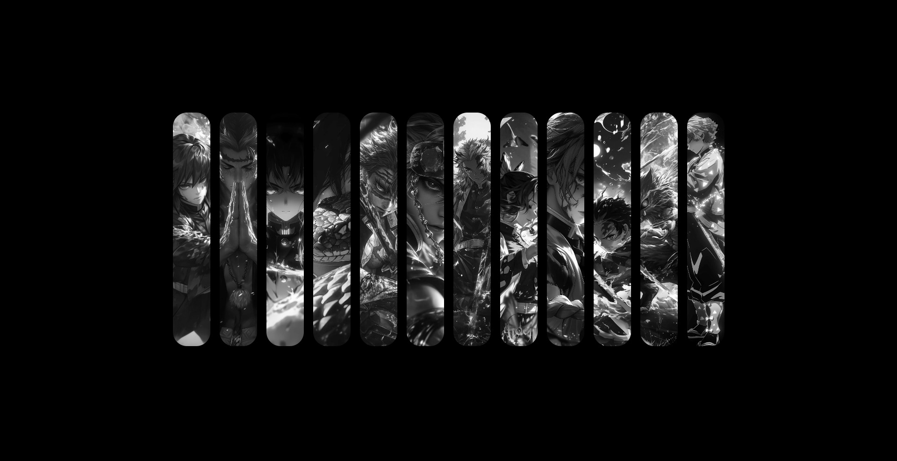
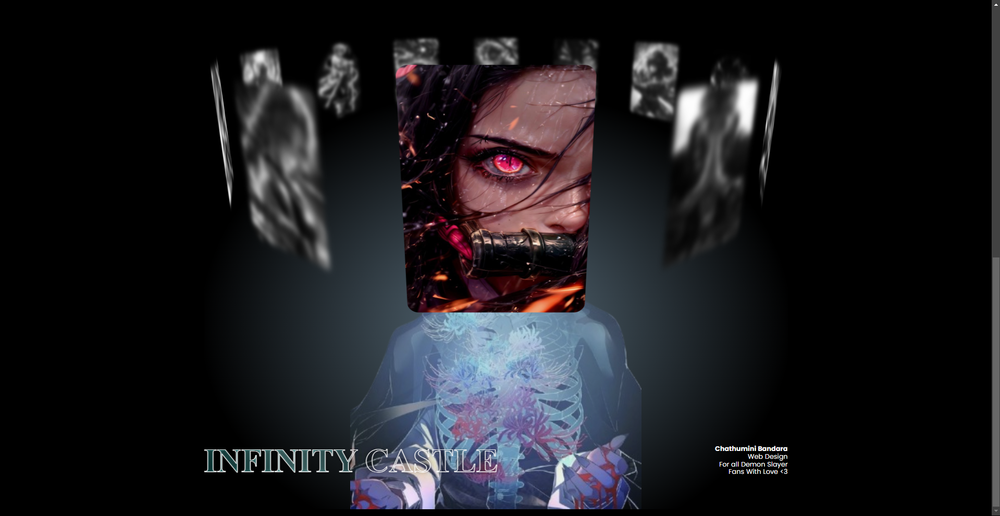
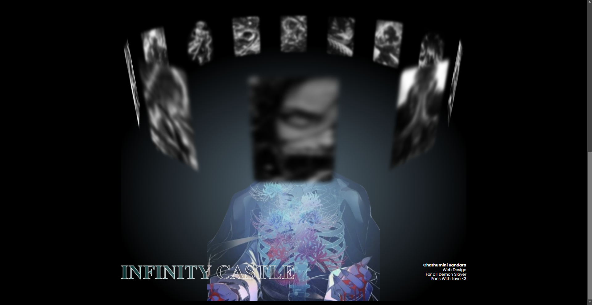
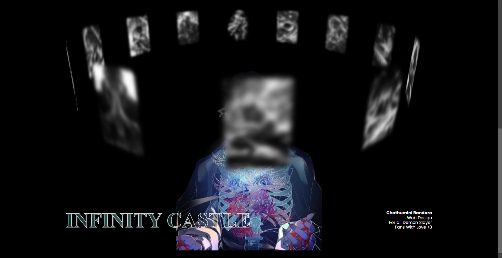

# Hashiras Expanding Gallery

**Project Overview:**  (￣o￣) . z Z

# Slider Coaster : New Feature はしら

# Click Each Tiles : See Magic はしら

The **Hashiras Expanding Gallery** is an interactive web application showcasing characters from *Demon Slayer*. Each character features stunning visuals and detailed profiles, allowing fans to explore their abilities and backgrounds.

**Key Features:**  ^_~
- Engaging character animations and transitions.
- MindBlowing Design for easy Demon Slayer fans.

**Technologies Used:**   (～￣▽￣)～
- HTML, CSS, JavaScript
- [Framework/Library Used] (e.g., React, Vue, etc.)

**Setup Instructions:**    []~(￣▽￣)~*
1. Clone the repository.
 
😏

**License:**
This project is licensed under the MIT License. See the [LICENSE](Licence.txt) file for more details.

ChathuminiBandara©™
